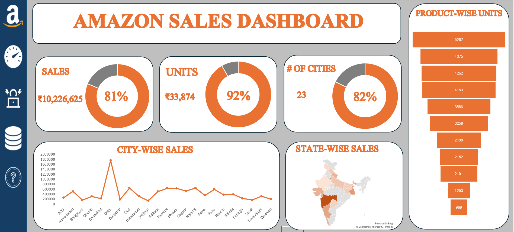

# Amazon Sales Analysis & Dashboard — Excel

## 📊 Project Overview

This project analyzes Amazon sales data using Microsoft Excel and presents the results through an interactive sales dashboard.

The project focuses on evaluating sales performance, product-wise unit sales, geographical sales distribution, and performance against predefined targets.

---

## 🎯 Business Objectives

- Analyze overall sales performance against targets
- Track total units sold and achievement percentage
- Analyze product-wise unit sales
- Identify sales performance across states and cities
- Compare actual performance with predefined targets
- Present key business metrics through an interactive dashboard

---

## 🗂️ Dataset

The dataset contains sales transaction records with the following fields:

- Date
- Sales Representative
- Product
- Units Sold
- Price
- Total Sale
- City
- State
- Region
- Day

The data covers sales transactions across multiple cities, states, regions, products, and sales representatives.

---

## 🛠️ Tools & Excel Skills

**Tool:**
- Microsoft Excel

**Skills demonstrated:**
- Data organization and tabular data handling
- Excel formulas and calculations
- KPI analysis
- Sales target analysis
- Product-wise analysis
- State-wise analysis
- City-wise analysis
- Data visualization
- Dashboard design
- Charts and geographical visualization

---

## 📈 Key Performance Indicators

The dashboard tracks:

| KPI | Actual | Target | Achievement |
|---|---:|---:|---:|
| Sales | ₹1,02,26,625 | ₹1,25,78,749 | 81% |
| Units Sold | 33,874 | 36,923 | 92% |
| Cities | 23 | 28 | 82% |

---

## 📊 Dashboard Analysis

The dashboard provides:

### Sales Performance
- Actual sales vs target sales
- Sales achievement percentage
- Sales performance difference

### Product Analysis
- Product-wise units sold
- Comparison of unit sales across products

### Geographic Analysis
- State-wise sales
- City-wise sales
- Regional sales distribution

### KPI Monitoring
- Total sales
- Total units sold
- Number of cities
- Target achievement

---

## 🖼️ Dashboard Preview



---

## 📁 Project Structure

```text
amazon-sales-analysis-excel/
│
├── README.md
│
├── Amazon_Sales_Dashboard.xlsx
│
└── images/
    └── amazon-sales-dashboard.png
